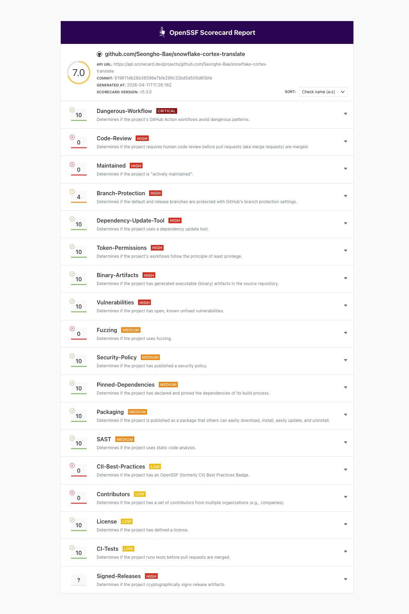
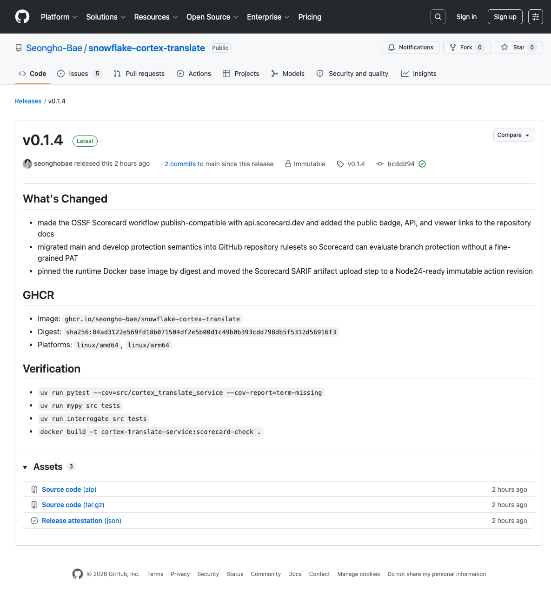

<!-- markdownlint-disable MD013 -->

# Release and Publishing Notes

This repository is prepared for public GitHub operation with CI, security
scanning, GitHub Pages publishing, and GHCR image releases.

## Required Repository Settings

Repository administrators should configure the following GitHub settings:

1. **GitHub Pages**
   - Source: **GitHub Actions**
   - Workflow: `.github/workflows/pages.yml`

2. **Branch protection / rulesets**
   - protect `main` and `develop`
   - require pull requests before merge
   - require conversation resolution
   - block force pushes and branch deletion
   - require these checks where applicable:
     - `pytest-coverage`
     - `mypy`
     - `docstring-coverage`
     - `dependency-review`
     - `codeql-python`
   - treat OSSF Scorecard as a monitored governance workflow even though it is
     not a pull-request status check

3. **Security features**
   - enable Dependabot alerts
   - enable Dependabot security updates
   - enable secret scanning and push protection if available
   - enable private vulnerability reporting / security advisories

4. **Workflow publication constraints**
   - keep the OSSF Scorecard analysis job publish-compatible with the Scorecard
     API by limiting that job to allowlisted `uses:` steps only
   - use a follow-up reporting job if you need shell-based summaries or API
     rechecks around Scorecard publication

## OSSF Scorecard API and Viewer

- API: <https://api.scorecard.dev/projects/github.com/Seongho-Bae/snowflake-cortex-translate>
- Viewer: <https://scorecard.dev/viewer/?uri=github.com/Seongho-Bae/snowflake-cortex-translate>
- Badge: <https://api.scorecard.dev/projects/github.com/Seongho-Bae/snowflake-cortex-translate/badge>



The screenshot above records what the public Scorecard viewer looked like after
publication. Use it as a visual reference for the expected page, then re-open
the live viewer URL to confirm current reachability and ingestion state.

The public API can return `404 Not Found` until a publishable Scorecard run on
`main` has been ingested. Re-run `.github/workflows/scorecard.yml` on `main`
after any publishability fix, then recheck the API and viewer.

## CI and Security Workflow Inventory

| Workflow | Purpose | Trigger |
| --- | --- | --- |
| `CI` | pytest coverage gate + mypy | push, pull request |
| `docstring-coverage` | enforces 100% docstring coverage | push, pull request |
| `Dependency Review` | blocks risky dependency diffs | pull request |
| `CodeQL` | static application security analysis | push, pull request, schedule |
| `OSSF Scorecard` | repository governance/security score | main, schedule, manual |
| `Pages` | deploys static content from `site/` | main, manual |
| `GHCR Release` | publishes signed multi-arch container images | semantic tag push |

## Pages Behavior

The Pages workflow publishes the repository's `site/` directory.

If `site/` is absent at workflow runtime, the workflow generates a minimal
fallback `site/index.html` page so that GitHub Pages remains deployable until
dedicated static assets are committed.

## GHCR Release Contract

Create semantic tags only from reviewed commits that are already on `main`.
For the target public repository (`Seongho-Bae/snowflake-cortex-translate`), the
published package path is expected to be:

```text
ghcr.io/seongho-bae/snowflake-cortex-translate
```

Recommended release commands:

```bash
git checkout main
git pull --ff-only origin main
git tag vX.Y.Z
git push origin main vX.Y.Z
```

The release workflow will:

- rerun pytest coverage and mypy before publishing
- reject tags that are not already merged into `main`
- build `linux/amd64` and `linux/arm64` images
- push to `ghcr.io/seongho-bae/snowflake-cortex-translate`
- attach SBOM and SLSA-style provenance attestations through BuildKit



The release page screenshot above captures the published `v0.1.4` GitHub
release with its current public notes and assets.

## Local Verification Before Release

```bash
uv run pytest --cov=src/cortex_translate_service --cov-report=term-missing
uv run mypy src tests
uv run interrogate src tests
docker build -t cortex-translate-service:local .
```

## Public API Baseline

- set `TRANSLATION_API_KEY` before enabling `POST /api/v1/translations`
- keep the endpoint behind upstream rate limiting and network controls when it
  is reachable outside localhost
- preserve the 5,000-character request cap unless a reviewed cost-control
  change explicitly updates it

## Operator Notes

- the Docker image starts the FastAPI app via `uvicorn`
- the runtime image drops privileges to a dedicated non-root user
- OCI-first local builders such as Podman may ignore Docker `HEALTHCHECK`
  metadata even though the GitHub Actions build still publishes the image
- runtime Snowflake credentials remain external to the image
- use `.env.example` and `config/connections.toml.example` as templates only
